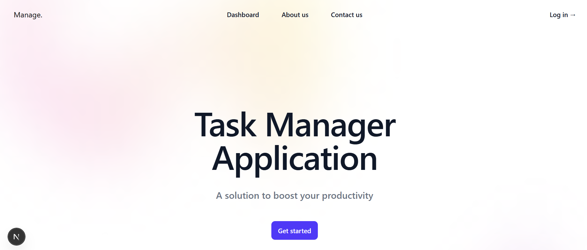
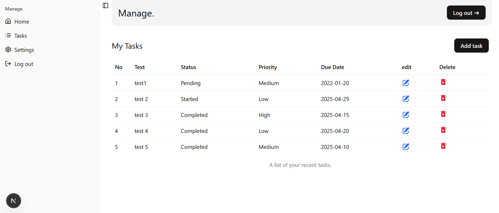

# 📝 Fullstack Task Manager

A fullstack **Task Manager** application built with **Next.js**, **Node.js**, **Prisma**, and **PostgreSQL**. This platform allows users to register, log in, and manage their tasks like create, update, and delete them with ease.

## 🚀 Features

- 🔐 User Authentication (Login & Signup)
- ✅ Create, Update, and Delete Tasks
- 📋 View list of tasks per user
- 🧩 Fullstack Integration using RESTful APIs
- 🗃️ PostgreSQL database with Prisma ORM
- 🌐 Built with modern web technologies (Next.js + Node.js)

## 🖼️ Screenshots




## 🛠️ Tech Stack

| Technology   | Description                      |
| ------------ | -------------------------------- |
| Next.js      | Frontend framework (React-based) |
| Node.js      | Backend runtime                  |
| Prisma       | Type-safe ORM for PostgreSQL     |
| PostgreSQL   | Relational database              |
| Tailwind CSS | (Optional) Styling (if used)     |
| JWT/Auth     | Secure authentication            |

## 📧 Contact

If you have any questions or suggestions, feel free to reach out:

- Email: developer.bilal.channa@gmail.com ✉️
- LinkedIn: [Profile](https://www.linkedin.com/in/Engineer-Bilal-Channa) 💼

<!-- # 📝 Fullstack Task Manager

A fullstack **Task Manager** application built with **Next.js**, **Node.js**, **Prisma**, and **PostgreSQL**. This platform allows users to register, log in, and manage their tasks—create, update, and delete them with ease.

---

## 🚀 Features

- 🔐 User Authentication (Login & Signup)
- ✅ Create, Update, and Delete Tasks
- 📋 View list of tasks per user
- 🧩 Fullstack Integration using RESTful APIs
- 🗃️ PostgreSQL database with Prisma ORM
- 🌐 Built with modern web technologies (Next.js + Node.js)

---

## 🛠️ Tech Stack

| Technology   | Description                        |
|--------------|------------------------------------|
| Next.js      | Frontend framework (React-based)   |
| Node.js      | Backend runtime                    |
| Prisma       | Type-safe ORM for PostgreSQL       |
| PostgreSQL   | Relational database                |
| Tailwind CSS | (Optional) Styling (if used)       |
| JWT/Auth     | Secure authentication              |

---

## 🖼️ Screenshots

> _Add screenshots or screen recordings of your app here to show off UI and functionality._
> Example:
> 

---

## 📦 Installation

### Prerequisites

- Node.js (v16+ recommended)
- PostgreSQL installed locally or through a service like Supabase, Neon, or Railway

### Clone the Repository

```bash
git clone https://github.com/your-username/task-manager-app.git
cd task-manager-app -->
